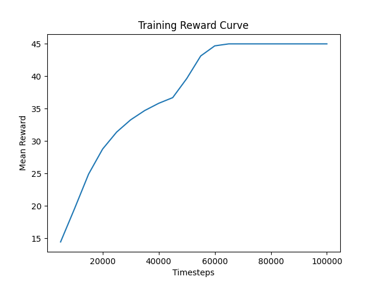

# Reinforcement Learning Self-Driving Car (Pygame + Gymnasium + PPO)

## Project Overview

This project implements a **Reinforcement Learning (RL) agent that learns to drive a car autonomously on a custom 2D racetrack**.
The environment is built using **Pygame**, wrapped with the **Gymnasium API**, and trained using the **Proximal Policy Optimization (PPO)** algorithm from Stable-Baselines3.

Instead of using images as input, the car perceives its environment using **ray-casting sensors** that measure distances to nearby walls, similar to LiDAR sensors used in real autonomous vehicles.

The goal of the agent is to **navigate the track without colliding with the walls while maximizing cumulative reward**.

---

## Technologies Used

* **Python**
* **Pygame** – simulation and rendering
* **Gymnasium** – RL environment interface
* **Stable-Baselines3** – PPO reinforcement learning algorithm
* **PyTorch** – neural network backend
* **Docker** – containerized project execution

---

## Key Features

• Custom reinforcement learning environment built with Gymnasium  
• Sensor-based perception using ray-casting (LiDAR-style)  
• PPO agent trained with Stable-Baselines3  
• Real-time visualization using Pygame  
• Containerized using Docker for reproducibility  

---

## System Architecture

The system consists of three major components:

1. **Pygame Simulation**

   * Implements the racetrack, car physics, and collision detection.
   * Visualizes the environment and sensor rays.

2. **Gymnasium Environment**

   * Wraps the simulation into a standard RL environment.
   * Handles observations, actions, rewards, and episode termination.

3. **PPO Reinforcement Learning Agent**

   * Learns an optimal driving policy based on sensor observations.
   * Maximizes reward by avoiding collisions and surviving longer.
```
        +--------------------+
        |   PPO RL Agent     |
        +---------+----------+
                  |
                  v
        +--------------------+
        | Gymnasium Env      |
        | (step / reset)     |
        +---------+----------+
                  |
                  v
        +--------------------+
        | Pygame Simulation  |
        | Car + Track        |
        +---------+----------+
                  |
                  v
        +--------------------+
        | Ray Sensors        |
        | Distance Readings  |
        +--------------------+
```
---

## Observation Space

The agent receives sensor readings representing distances to walls.

Example observation:

```text
[r1, r2, r3, r4, r5, velocity]
```

Where:

* `r1–r5` = normalized ray distances
* `velocity` = current car speed

All values are normalized between **0 and 1**.

---

## Action Space

The agent can perform five discrete actions:

```text
0 → No action
1 → Accelerate
2 → Brake
3 → Turn left
4 → Turn right
```

---

## Reward Function

The reward function encourages safe driving:

| Event          | Reward |
| -------------- | ------ |
| Moving forward | +0.1   |
| Time penalty   | −0.01  |
| Collision      | −10    |

This reward shaping encourages the agent to **keep moving while avoiding collisions**.

---

## Project Structure

```
car_rl_agent/
│
├── Dockerfile
├── requirements.txt
├── config.yaml
├── train.py
├── evaluate.py
├── record_video.py
├── README.md
│
├── src/
│   ├── environment.py
│   ├── car.py
│   └── utils.py
│
├── tracks/
│   └── track_1.txt
│
├── models/
│   └── ppo_car_agent.zip
│
└── results/
    ├── agent_demonstration.mp4
    ├── reward_curve.png
    └── training_log.json
```

---

## Setup Instructions

### 1. Clone the repository

```bash
git clone https://github.com/ashifa-1/car_rl_agent
cd car_rl_agent
```

### 2. Create a virtual environment

```bash
python -m venv venv
```

### 3. Activate the environment

Windows:

```bash
venv\Scripts\activate
```

Linux / Mac:

```bash
source venv/bin/activate
```

### 4. Install dependencies

```bash
pip install -r requirements.txt
```

---

## Training the Agent

Run the training script:

```bash
python train.py
```

Training will:

* train the PPO agent
* save the trained model
* generate training logs
* create a reward curve plot

Outputs generated:

```
models/ppo_car_agent.zip
results/training_log.json
results/reward_curve.png
```

---

## Evaluating the Agent

Run the evaluation script:

```bash
python evaluate.py
```

Example output:

```
Mean Reward: 45.0
Std Reward: 0.0
```

---

## Recording Agent Demonstration

Generate a video showing the trained agent driving:

```bash
python record_video.py
```

The output video will be saved as:

```
results/agent_demonstration.mp4
```

---

## Docker Setup

Build the Docker image:

```bash
docker build -t car-agent .
```

Run evaluation inside the container:

```bash
docker run car-agent
```

---

## Training Results and Performance Analysis

The agent was trained for **100,000 timesteps** using PPO.

Key observations:

* The reward steadily increased during training.
* The agent eventually stabilized at **~45 reward per episode**.
* This corresponds to **surviving the full episode without crashing**.

The learning curve is visualized in:

```
results/reward_curve.png
```

The following graph shows the learning progress of the agent during training.



## Agent Demonstration

After training, the agent successfully learns to drive around the track without crashing.

The demonstration video can be found here:

results/agent_demonstration.mp4

Evaluation results:

```
Mean Reward: 45.0
Std Reward: 0.0
```

This indicates the agent learned a **stable driving policy** and consistently completes episodes without collision.

---

## Conclusion

This project demonstrates how reinforcement learning can be applied to autonomous driving tasks using simulation.
By combining a custom environment, sensor-based perception, and the PPO algorithm, the agent successfully learns to navigate a track safely.

The project provides a practical introduction to:

* Reinforcement learning environment design
* Sensor-based perception systems
* Training autonomous agents
* Deploying ML projects using Docker
